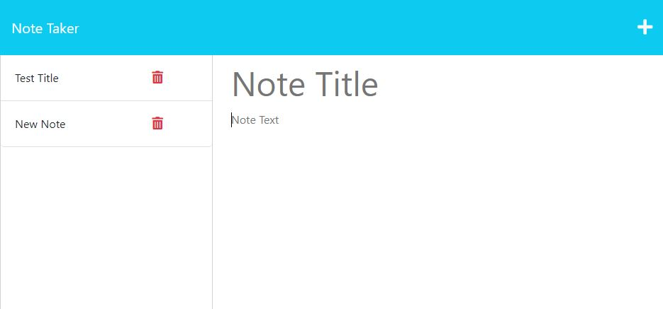

# Taking_Notes


## Description

Create and read notes to store on a server

## Table of Contents 

* [Installation](#installation)

* [Usage](#usage)

* [License](#license)

* [Contributing](#contributing)

* [Tests](#tests)

* [Questions](#questions)

## Installation

To install necessary dependencies, run the following command:

```
npm i
```

## Usage

Clone the repo and use node server.js to run the app

## License

This project is licensed under the MIT license.
  
## Contributing

Nothing

## Tests

To run tests, run the following command:

```
There are no tests
```

## Screenshots



## Questions

If you have any questions about the repo, open an issue or contact me directly at daniel.robe@verizon.net. You can find more of my work at [Daniel.robe](https://github.com/Daniel.robe/).

